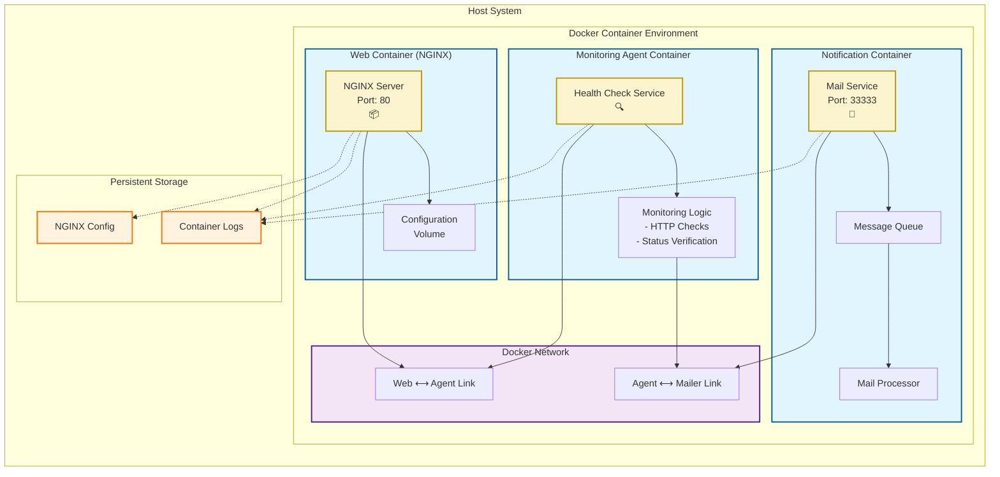

# 🚀 Docker Monitored NGINX Implementation

[](https://github.com/TheToriqul/docker-monitored-nginx)
[](https://github.com/TheToriqul/docker-monitored-nginx/stargazers)


## 📋 Overview

This project demonstrates my implementation of a monitored NGINX web server using Docker containers. Through this hands-on experience, I've developed a robust understanding of container orchestration, monitoring systems, and automated notifications. The system showcases practical implementations of container linking, health monitoring, and automated alert systems - essential skills for modern DevOps practices.

## 🏗 Technical Architecture

The system consists of three interconnected Docker containers, each serving a specific purpose in the monitoring ecosystem:



## 💻 Technical Stack

- **Container Platform**: Docker 
- **Web Server**: NGINX latest
- **Base Images**: 
  - NGINX (Web Server)
  - Busybox (Monitoring & Mailer)
- **Scripting**: Shell scripting for automation
- **Networking**: Container linking and TCP/IP communication

## ⭐ Key Features

1. Container Orchestration
   - Multi-container architecture
   - Inter-container communication
   - Container lifecycle management

2. Monitoring System
   - Real-time health checks
   - Automated status verification
   - Custom monitoring intervals

3. Notification System
   - Event-triggered alerts
   - Email notification capability
   - Custom message formatting

4. Security Features
   - Isolated container networks
   - Non-root user execution
   - Restricted container permissions

5. Logging & Debugging
   - Container log management
   - Real-time log monitoring
   - Diagnostic capabilities

6. High Availability
   - Container restart policies
   - Health check mechanisms
   - Failure detection and notification

## 📚 Learning Journey

### Technical Mastery:

1. Container Orchestration
   - Creating and managing multiple containers
   - Understanding container networking
   - Implementing container communication

2. Monitoring Systems
   - Setting up health checks
   - Implementing monitoring scripts
   - Managing system alerts

3. Automation
   - Shell script development
   - Automated notification systems
   - Container lifecycle automation

4. System Architecture
   - Multi-container design
   - Service isolation
   - Component communication

5. DevOps Practices
   - Container management
   - System monitoring
   - Automated notifications

### Professional Development:

1. Problem-Solving
   - Debugging container issues
   - Network troubleshooting
   - System optimization

2. System Design
   - Architecture planning
   - Component isolation
   - Service integration

3. Documentation
   - Technical documentation
   - Command reference
   - System architecture

## 🔄 Future Enhancements

<details>
<summary>View Planned Improvements</summary>

1. Implement container orchestration using Docker Compose
2. Add Prometheus monitoring integration
3. Enhance notification system with multiple channels
4. Implement automated scaling based on load
5. Add visualization dashboard for monitoring
6. Implement SSL/TLS for secure communication

</details>

## ⚙️ Installation

<details>
<summary>View Installation Details</summary>

### Prerequisites

- Docker Engine installed
- Basic understanding of shell commands
- Network access for container communication

### Setup Steps

1. Clone the repository:
   ```bash
   git clone https://github.com/TheToriqul/docker-monitored-nginx.git
   ```

2. Navigate to project directory:
   ```bash
   cd docker-monitored-nginx
   ```

3. Build and start containers:
   ```bash
   # Build containers
   docker build -t mailer-image ./mailer
   docker build -t watcher-image ./watcher
   
   # Start containers
   docker run -d --name web nginx:latest
   docker run -d --name mailer mailer-image
   docker run -d --name agent --link web:insideweb --link mailer:insidemailer watcher-image
   ```

</details>

## 📖 Usage Guide

<details>
<summary>View Usage Details</summary>

### Basic Usage

1. Check container status:
   ```bash
   docker ps
   ```

2. Monitor container logs:
   ```bash
   docker logs -f agent
   ```

3. Test notification system:
   ```bash
   docker stop web
   docker logs mailer
   ```

### Troubleshooting

- Check container connectivity using the interactive test container
- Verify logs for each container
- Ensure all required ports are accessible

</details>

## 📫 Contact

- 📧 Email: toriqul.int@gmail.com
- 📱 Phone: +65 8936 7705, +8801765 939006

## 🔗 Project Links

- [GitHub Repository](https://github.com/TheToriqul/docker-monitored-nginx)
- [Documentation](https://github.com/TheToriqul/docker-monitored-nginx/wiki)

## 👏 Acknowledgments

- [Poridhi for excellent labs](https://poridhi.io/)
- Docker community for extensive documentation
- NGINX team for robust web server implementation

---

Feel free to explore, modify, and build upon this configuration as part of my learning journey. You're also welcome to learn from it, and I wish you the best of luck!